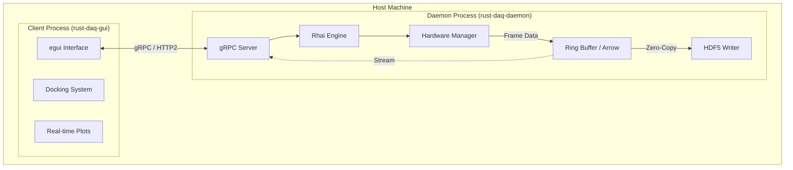

# Rust DAQ System Architecture

## Overview

`rust-daq` is a modular, high-performance data acquisition system built in Rust. It is designed for scientific experiments requiring low-latency hardware control, high-throughput data streaming, and crash-resilient operation.

The architecture follows a **Headless-First** design: the core daemon runs as a robust, autonomous process that owns the hardware, while the user interface runs as a separate, lightweight client. This ensures that a GUI crash never interrupts a running experiment.

## Core Design Principles

1.  **Crash Resilience:** Strict separation between the Daemon (Rust) and the Client (`egui`).
2.  **Capability-Based Hardware:** Drivers are composed of atomic traits (`Movable`, `Triggerable`) rather than monolithic inheritance.
3.  **Hot-Swappable Logic:** Experiments are defined in **Rhai** scripts, allowing logic changes without recompiling the daemon.
4.  **Zero-Copy Data Path:** High-speed data flows through a memory-mapped ring buffer (Arrow IPC) for visualization and storage.

---

## System Components

The project is structured as a Cargo workspace with distinct responsibilities:

### 1. Application Layer
*   **`daq-bin`**: The entry point for the daemon (`rust-daq-daemon`). Wires together the system based on compile-time features.
*   **`daq-egui`**: The desktop client application. Built with `egui` and `egui_dock` for a flexible, pane-based layout. Connects to the daemon via gRPC.
*   **`rust-daq`**: A facade crate providing a clean `prelude` for external consumers and integration tests.

### 2. Domain Logic
*   **`daq-experiment`**: The orchestration engine ("RunEngine"). Executes declarative plans and manages the experiment state machine.
*   **`daq-scripting`**: Embeds the **Rhai** scripting engine. Provides a safe sandbox for user scripts to control hardware (10k operation limit, timeout protection).
*   **`daq-server`**: The network interface. Implements a gRPC server (`tonic`) exposing hardware control, script execution, and data streaming.

### 3. Infrastructure
*   **`daq-hardware`**: The Hardware Abstraction Layer (HAL). Defines capability traits and contains drivers for physical devices (Thorlabs, Newport, PVCAM, etc.).
*   **`daq-storage`**: Handles data persistence. Implements the "Mullet Strategy": fast **Arrow** ring buffer in the front, reliable **HDF5** writer in the back.
*   **`daq-proto`**: Defines the wire protocol (Protobuf) for all network communication.

### 4. Core
*   **`daq-core`**: The foundation. Defines shared types (`Parameter<T>`, `Observable<T>`), error handling, and the capability traits.

---

## Architectural Diagrams

### High-Level Topology



### Data Pipeline (The "Mullet Strategy")

To resolve the conflict between high-throughput reliable storage and low-latency live visualization, the system implements a **Tee-based Pipeline**:

1.  **Source:** Hardware drivers produce data (e.g., `Arc<Frame>`).
2.  **Ring Buffer:** Data is written to a lock-free, memory-mapped Ring Buffer using Apache Arrow IPC format.
3.  **Storage Path:** A dedicated background thread reads from the Ring Buffer and writes to HDF5 files.
4.  **Live Stream:** The `DaqServer` subscribes to the stream and broadcasts it via gRPC to the GUI.

---

## Key Features

### Hardware Abstraction
Hardware is modeled by **Capabilities**, not identities. A device is defined by what it can *do*:
*   `Movable`: Can move to a position (e.g., Motors, Piezo stages).
*   `Triggerable`: Can accept a start signal (e.g., Cameras).
*   `Readable`: Can return a scalar value (e.g., Sensors).
*   `FrameProducer`: Can stream 2D image data (e.g., Detectors).
*   `ExposureControl`: Can set integration time.

This allows generic experiment scripts to work with any compatible hardware (e.g., `scan(movable, triggerable)`).

### Reactive Parameters
All hardware state is managed via `Parameter<T>`. This provides:
*   **Observability:** Changes are broadcast to all subscribers (GUI, Scripts).
*   **Validation:** Setters can reject invalid values.
*   **Persistence:** Parameter values are snapshotted to HDF5.

### Scripting (Rhai)
Experiments are written in [Rhai](https://rhai.rs), a scripting language designed for Rust.
*   **Safety:** Scripts run in a sandbox with operation limits to prevent infinite loops.
*   **Integration:** Rust async functions are exposed as synchronous Rhai functions (e.g., `stage.move_abs(10.0)`).
*   **Hot-Swap:** Scripts are uploaded via gRPC and executed immediately.

---

## Directory Structure

```
.
├── crates/
│   ├── daq-bin/        # Application entry points
│   ├── daq-core/       # Shared types and traits
│   ├── daq-egui/       # GUI implementation (egui)
│   ├── daq-experiment/ # RunEngine and Plans
│   ├── daq-hardware/   # Drivers and HAL
│   ├── daq-proto/      # gRPC/Protobuf definitions
│   ├── daq-scripting/  # Rhai integration
│   ├── daq-server/     # gRPC server implementation
│   ├── daq-storage/    # Arrow/HDF5 handling
│   └── rust-daq/       # Facade/Integration crate
├── config/             # Runtime configuration
└── docs/               # Documentation
```
