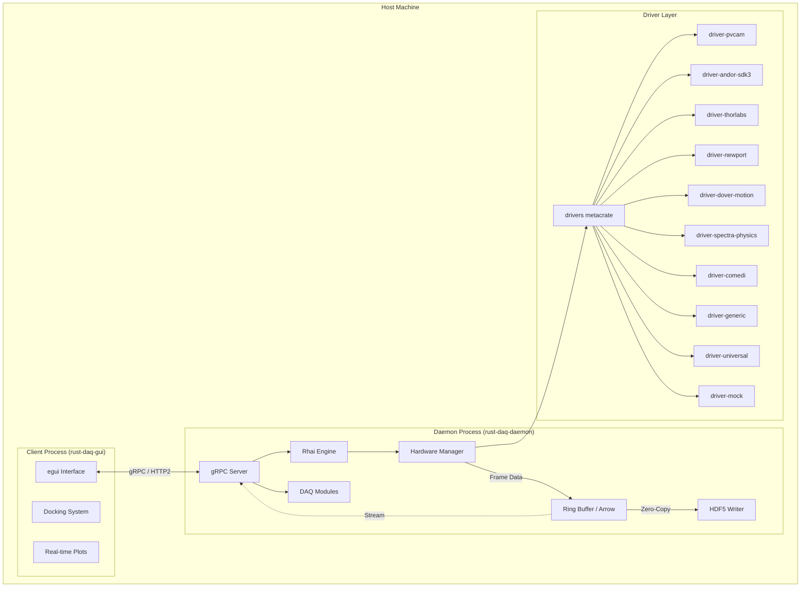

# Rust DAQ System Architecture

## Overview

`rust-daq` is a modular, high-performance data acquisition system built in Rust. It is designed for scientific experiments requiring low-latency hardware control, high-throughput data streaming, and crash-resilient operation.

The architecture follows a **Headless-First** design: the core daemon runs as a robust, autonomous process that owns the hardware, while the user interface runs as a separate, lightweight client. This ensures that a GUI crash never interrupts a running experiment.

## Core Design Principles

1.  **Crash Resilience:** Strict separation between the Daemon (Rust) and the Client (`egui`).
2.  **Capability-Based Hardware:** Drivers are composed of atomic traits (`Movable`, `Triggerable`) rather than monolithic inheritance.
3.  **Hot-Swappable Logic:** Experiments are defined in **Rhai** scripts, allowing logic changes without recompiling the daemon.
4.  **Zero-Copy Data Path:** High-speed data flows through a memory-mapped ring buffer (Arrow IPC) for visualization and storage.

---

## System Components

The project is structured as a Cargo workspace with 31 crates organized by layer:

### 1. Application Layer
*   **`bin`**: The entry point for the daemon (`rust-daq-daemon`). Wires together the system based on compile-time features.
*   **`ui`**: The desktop client application. Built with `egui` and `egui_dock` for a flexible, pane-based layout. Connects to the daemon via gRPC. Features auto-reconnect with exponential backoff, health monitoring, and real-time logging panel.
*   **`client`**: gRPC client library for connecting to the daemon. Provides a typed API for remote hardware control, streaming, and device management.

### 2. Domain Logic
*   **`experiment`**: The orchestration engine ("RunEngine"). Executes declarative plans and manages the experiment state machine.
*   **`scripting`**: Embeds the **Rhai** scripting engine. Provides a safe sandbox for user scripts to control hardware (10k operation limit, timeout protection). Optional Python bindings via PyO3.
*   **`server`**: The network interface. Implements a gRPC server (`tonic`) exposing hardware control, script execution, and data streaming. Includes token-based authentication and CORS configuration.
*   **`daq-modules`**: Experiment modules and plugin system. Provides a modular framework for composing experiment workflows with runtime module assignment.

### 3. Hardware Abstraction
*   **`hardware`**: The Hardware Abstraction Layer (HAL). Defines capability traits, `DeviceRegistry`, and `DriverFactory`. Also contains legacy serial drivers (migration to standalone crates in progress).
*   **`drivers`**: Metacrate aggregating all driver crates with unified feature flags. Provides convenience feature sets (`all`, `maitai`, `hardware`) so consumers can depend on a single crate.

### 4. Driver Crates (Standalone)

Each driver lives in its own crate for independent compilation, testing, and optional inclusion:

#### Camera Drivers
*   **`driver-pvcam`**: Photometrics PVCAM cameras (Prime 95B, Prime BSI). Requires PVCAM SDK.
*   **`driver-andor-sdk3`**: Andor iStar camera and Shamrock spectrograph via SDK3.

#### Motion Control
*   **`driver-thorlabs`**: Thorlabs ELL14 rotation mounts (RS-485 multidrop bus).
*   **`driver-newport`**: Newport ESP300 motion controller and 1830-C power meter.
*   **`driver-dover-motion`**: Dover Motion SmartStage driver via MotionSynergyAPI FFI.

#### Laser & Light Sources
*   **`driver-spectra-physics`**: Spectra-Physics MaiTai Ti:Sapphire tunable laser.

#### DAQ & Signal
*   **`driver-comedi`**: Linux Comedi DAQ boards (NI PCI-MIO-16XE-10). Analog/digital I/O.
*   **`driver-red-pitaya`**: Red Pitaya FPGA board for signal generation.

#### Generic & Testing
*   **`driver-universal`**: Universal config-driven driver (schema v3). Define new instruments via TOML files without writing Rust code. Supports serial, TCP, and SCPI transports with MiniJinja templates, tiered response parsing, and evalexpr formula evaluation. Successor to `driver-generic`.
*   **`driver-generic`**: Original config-driven serial driver (schema v2). Superseded by `driver-universal` for new devices, but still in the workspace.
*   **`driver-mock`**: Mock hardware drivers for testing, simulation, and demo mode.

### 5. Infrastructure
*   **`pool`**: Zero-allocation object pool for high-performance frame handling. Provides `Pool<T>` for generic objects and `BufferPool` for byte buffers with `bytes::Bytes` integration. Critical for high-FPS camera streaming where per-frame allocations cause latency.
*   **`storage`**: Handles data persistence. Implements the "Mullet Strategy": fast **Arrow** ring buffer in the front, reliable **HDF5** writer in the back. Also supports CSV, MATLAB (.mat), and NetCDF formats.
*   **`protocol`**: Defines the wire protocol (Protobuf) for all network communication. Includes domain↔proto conversion utilities.
*   **`plugin-api`**: Native FFI plugin system using `abi_stable` for cross-version binary compatibility. Enables third-party Rust plugins without recompilation.
*   **`plugin-example`**: Example plugin implementation demonstrating the plugin-api.

### 6. Core
*   **`common`**: The foundation. Defines shared types (`Parameter<T>`, `Observable<T>`), error handling, size limits (`limits.rs`), and module domain types.

### 7. FFI Bindings
*   **`pvcam-sys`**: Raw FFI bindings to the PVCAM C library (nested under `driver-pvcam`).
*   **`comedi-sys`**: Raw FFI bindings to the Linux Comedi library.
*   **`andor-sdk3-sys`**: Raw FFI bindings to the Andor SDK3 C library.
*   **`dover-motion-sys`**: Raw FFI bindings to the Dover MotionSynergyAPI C library.

### 8. Testing
*   **`integration-tests`**: Workspace-level integration test suite covering cross-crate workflows.

---

## Architectural Diagrams

### High-Level Topology


```mermaid
graph TD
    subgraph "Host Machine"
        subgraph "Daemon Process (rust-daq-daemon)"
            Server[gRPC Server]
            Script[Rhai Engine]
            Modules[DAQ Modules]
            HW[Hardware Manager]
            Ring[Ring Buffer / Arrow]
            Writer[HDF5 Writer]
        end

        subgraph "Client Process (rust-daq-gui)"
            GUI[egui Interface]
            Dock[Docking System]
            Plot[Real-time Plots]
        end

        subgraph "Driver Layer"
            DrvMeta[drivers metacrate]
            DrvPvcam[driver-pvcam]
            DrvAndor[driver-andor-sdk3]
            DrvThorlabs[driver-thorlabs]
            DrvNewport[driver-newport]
            DrvDover[driver-dover-motion]
            DrvSpectra[driver-spectra-physics]
            DrvComedi[driver-comedi]
            DrvGeneric[driver-generic]
            DrvUniversal[driver-universal]
            DrvMock[driver-mock]
        end
    end

    GUI <-->|gRPC / HTTP2| Server

    Server --> Script
    Server --> Modules
    Script --> HW
    HW --> DrvMeta
    DrvMeta --> DrvPvcam & DrvAndor & DrvThorlabs & DrvNewport & DrvDover & DrvSpectra & DrvComedi & DrvGeneric & DrvUniversal & DrvMock
    HW -->|Frame Data| Ring
    Ring -->|Zero-Copy| Writer
    Ring -.->|Stream| Server
```

### Data Pipeline (The "Mullet Strategy")

To resolve the conflict between high-throughput reliable storage and low-latency live visualization, the system implements a **Tee-based Pipeline**:

1.  **Source:** Hardware drivers produce data (e.g., `Arc<Frame>`).
2.  **Ring Buffer:** Data is written to a lock-free, memory-mapped Ring Buffer using Apache Arrow IPC format.
3.  **Storage Path:** A dedicated background thread reads from the Ring Buffer and writes to HDF5 files.
4.  **Live Stream:** The `DaqServer` subscribes to the stream and broadcasts it via gRPC to the GUI.

---

## Key Features

### Hardware Abstraction
Hardware is modeled by **Capabilities**, not identities. A device is defined by what it can *do*:
*   `Movable`: Can move to a position (e.g., Motors, Piezo stages, rotators).
*   `Triggerable`: Can accept a start signal (e.g., Cameras).
*   `Readable`: Can return a scalar value (e.g., Sensors, power meters).
*   `FrameProducer`: Can stream 2D image data (e.g., Detectors, cameras).
*   `ExposureControl`: Can set integration time.
*   `WavelengthTunable`: Can tune wavelength (e.g., Lasers, monochromators).
*   `ShutterControl`: Can open/close a beam shutter.
*   `EmissionControl`: Can enable/disable laser emission.
*   `Parameterized`: Exposes reactive `Parameter<T>` state for observation and persistence.

This allows generic experiment scripts to work with any compatible hardware (e.g., `scan(movable, triggerable)`).

### Reactive Parameters
All hardware state is managed via `Parameter<T>`. This provides:
*   **Observability:** Changes are broadcast to all subscribers (GUI, Scripts).
*   **Validation:** Setters can reject invalid values.
*   **Persistence:** Parameter values are snapshotted to HDF5.

### Scripting (Rhai)
Experiments are written in [Rhai](https://rhai.rs), a scripting language designed for Rust.
*   **Safety:** Scripts run in a sandbox with operation limits to prevent infinite loops.
*   **Integration:** Rust async functions are exposed as synchronous Rhai functions (e.g., `stage.move_abs(10.0)`).
*   **Hot-Swap:** Scripts are uploaded via gRPC and executed immediately.

---

## Directory Structure

```
.
├── crates/
│   ├── bin/                  # Application entry points (daemon, CLI)
│   ├── client/               # gRPC client library
│   ├── common/               # Foundation types, errors, parameters, limits
│   ├── daq-modules/          # Experiment modules and plugin system
│   ├── drivers/              # Metacrate aggregating all drivers (feature flags)
│   ├── driver-andor-sdk3/    # Andor iStar camera / Shamrock spectrograph
│   ├── driver-comedi/        # Comedi DAQ driver for Linux boards
│   ├── driver-dover-motion/  # Dover Motion SmartStage driver
│   ├── driver-generic/       # Config-driven serial driver (schema v2)
│   ├── driver-universal/     # Universal config-driven driver (schema v3)
│   ├── driver-mock/          # Mock hardware for testing/demo
│   ├── driver-newport/       # Newport ESP300 + 1830-C power meter
│   ├── driver-pvcam/         # PVCAM camera driver
│   │   └── pvcam-sys/        # Raw FFI bindings to PVCAM
│   ├── driver-red-pitaya/    # Red Pitaya FPGA board
│   ├── driver-spectra-physics/ # Spectra-Physics MaiTai laser
│   ├── driver-thorlabs/      # Thorlabs ELL14 rotators
│   ├── andor-sdk3-sys/       # Raw FFI bindings to Andor SDK3
│   ├── comedi-sys/           # Raw FFI bindings to Comedi
│   ├── dover-motion-sys/     # Raw FFI bindings to Dover MotionSynergyAPI
│   ├── experiment/           # RunEngine and Plan definitions
│   ├── hardware/             # HAL with capability traits and DeviceRegistry
│   ├── integration-tests/    # Cross-crate integration tests
│   ├── plugin-api/           # Native FFI plugin system (abi_stable)
│   ├── plugin-example/       # Example plugin implementation
│   ├── pool/                 # Zero-allocation object pool for frame handling
│   ├── protocol/             # Protobuf definitions and conversions
│   ├── scripting/            # Rhai scripting engine integration
│   ├── server/               # gRPC server implementation
│   ├── storage/              # Ring buffers, CSV, HDF5, Arrow storage
│   └── ui/                   # Desktop GUI (egui + egui_dock)
├── config/                   # Runtime configuration (TOML)
│   └── devices/              # Declarative driver configs (TOML)
├── docs/                     # Documentation
│   ├── architecture/         # ADRs and design decisions
│   ├── benchmarks/           # Performance documentation
│   ├── guides/               # User and developer guides
│   ├── project_management/   # Roadmaps and planning
│   └── troubleshooting/      # Platform notes and setup guides
├── examples/                 # Rhai script examples
└── proto/                    # Protobuf source files
```

---

## Module Decomposition (2026-02 Tech Debt Remediation)

Several monolithic files have been decomposed into bounded submodules to improve
maintainability and review surface. Public API paths are preserved via re-exports.

### driver-pvcam

`crates/driver-pvcam/src/` — directory module:

| File | Lines | Responsibility |
|------|-------|----------------|
| `lib.rs` | ~600 | PvcamDriver struct, trait impls, entry point |
| `components/acquisition/` | ~350 | Frame acquisition loop, callback handling |
| `components/features/` | ~200 | PVCAM feature enumeration and parameter mapping |

### ui::panels::image_viewer

`crates/ui/src/panels/image_viewer/` — directory module:

| File | Lines | Responsibility |
|------|-------|----------------|
| `mod.rs` | ~3360 | ImageViewerPanel struct, impl, tests |
| `processing.rs` | ~440 | RGBA conversion pipeline, histogram computation |
| `colormap.rs` | ~260 | Colormap LUTs, ContrastMode, ScaleMode enums |
| `types.rs` | ~220 | FrameUpdate, StreamMetrics, state enums, channels |

### server::grpc::hardware_service

`crates/server/src/grpc/hardware_service/` — directory module:

| File | Lines | Responsibility |
|------|-------|----------------|
| `mod.rs` | ~2930 | HardwareServiceImpl struct, gRPC trait impl, tests |
| `helpers.rs` | ~370 | Validation, error mapping, proto conversions |
| `streaming.rs` | ~225 | GrpcStreamObserver, StreamLimiter |

---

## Legacy Migration Status

The following items carry `#[deprecated(since = "...", note = "Sunset: v1.0")]`
annotations and are scheduled for removal at v1.0:

| Item | Crate | Replacement |
|------|-------|-------------|
| `DataPoint` | common | `Observable<T>` / `Parameter<T>` |
| `DeviceConfig` (schema v2) | hardware | `UniversalDriverConfig` (schema v3) |
| `GenericSerialDriver` | hardware | `driver-universal` crate |
| `GenericDriver::new` | hardware | `UniversalDriver::from_config` |
| `ScriptHost` | scripting | `ScriptEngine` |
| `ScanServiceImpl` | server | `RunEngineService` |
| `TiffWriter::write_frame` | storage | `TiffWriter::write_frame_data` |
| `take_frame_receiver` / `subscribe_frames` | common | `FrameObserver` trait |
| `Ell14Driver` legacy constructors | hardware | `Ell14Driver::from_config` |
| `PvcamDriver::new` | driver-pvcam | `PvcamDriver::from_config` |

**Zero-caller deprecated items removed in this cycle:**
- `InstrumentConfigV3` type alias (common)
- `CodePreviewPanel::ui()` method (ui)
- `execute_script` free function (hardware)
