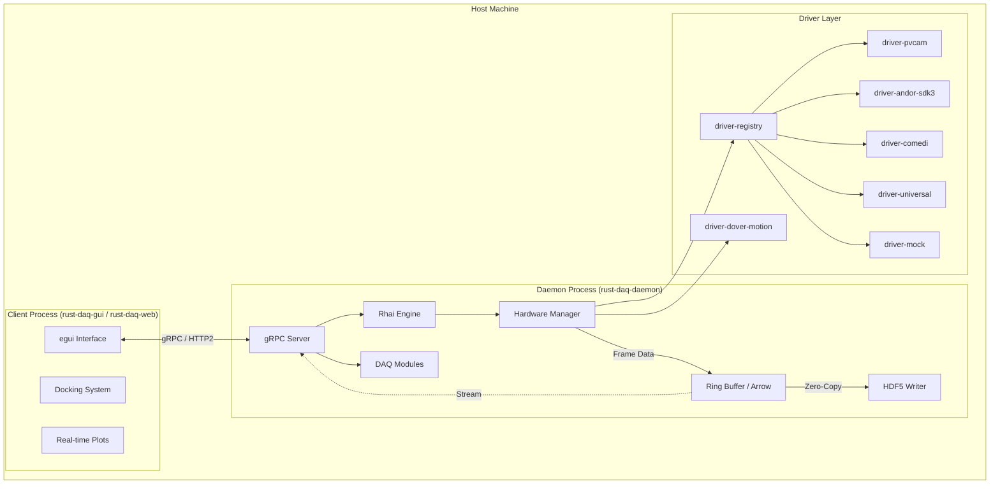

# Rust DAQ System Architecture

## Overview

`rust-daq` is a modular, high-performance data acquisition system built in Rust. It is designed for scientific experiments requiring low-latency hardware control, high-throughput data streaming, and crash-resilient operation.

The architecture follows a **Headless-First** design: the core daemon runs as a robust, autonomous process that owns the hardware, while the user interface runs as a separate, lightweight client. This ensures that a GUI crash never interrupts a running experiment.

## Core Design Principles

1.  **Crash Resilience:** Strict separation between the daemon and the client UIs (`egui` native/WASM, plus experimental `ui-slint`).
2.  **Capability-Based Hardware:** Drivers are composed of atomic traits (`Movable`, `Triggerable`) rather than monolithic inheritance.
3.  **Hot-Swappable Logic:** Experiments are defined in **Rhai** scripts, allowing logic changes without recompiling the daemon.
4.  **Zero-Copy Data Path:** High-speed data flows through a memory-mapped ring buffer (Arrow IPC) for visualization and storage.

---

## System Components

The project is structured as a Cargo workspace with 26 crates organized by layer:

### 1. Application Layer
*   **`bin`**: The entry point for the daemon (`rust-daq-daemon`). Wires together the system based on compile-time features.
*   **`ui`**: The main `egui` client crate. Produces the native desktop GUI (`rust-daq-gui`) and the browser/WASM GUI (`rust-daq-web`). Connects to the daemon via gRPC or gRPC-web depending on platform.
*   **`ui-slint`**: Experimental Slint-based UI workspace member used for evaluation and benchmarks.
*   **`client`**: gRPC client library for connecting to the daemon. Provides a typed API for remote hardware control, streaming, and device management.

### 2. Domain Logic
*   **`experiment`**: The orchestration engine ("RunEngine"). Executes declarative plans and manages the experiment state machine.
*   **`scripting`**: Embeds the **Rhai** scripting engine. Provides a safe sandbox for user scripts to control hardware (10k operation limit, timeout protection). Optional Python bindings via PyO3.
*   **`server`**: The network interface. Implements a gRPC server (`tonic`) exposing hardware control, script execution, and data streaming. Includes token-based authentication and CORS configuration.
*   **`daq-modules`**: Experiment modules and plugin system. Provides a modular framework for composing experiment workflows with runtime module assignment.

### 3. Hardware Abstraction
*   **`hardware`**: The Hardware Abstraction Layer (HAL). Defines capability traits, `DeviceRegistry`, and config/schema loading. Concrete driver feature selection now lives in `driver-registry`.

### 4. Driver Crates (Standalone)

Each driver lives in its own crate for independent compilation, testing, and optional inclusion:

#### Registry & Feature Gating
*   **`driver-registry`**: Concrete factory registration and hardware feature gating. Always registers `driver-mock` and `driver-universal`; optionally includes `driver-pvcam`, `driver-andor-sdk3`, `driver-comedi` behind feature flags (pvcam, andor, comedi, all_hardware, full).

#### Camera Drivers (Native SDK)
*   **`driver-pvcam`**: Photometrics PVCAM cameras (Prime 95B, Prime BSI). Requires PVCAM SDK.
*   **`driver-andor-sdk3`**: Andor iStar camera and Shamrock spectrograph via SDK3.

#### Motion Control (Native SDK)
*   **`driver-dover-motion`**: Dover Motion SmartStage driver via MotionSynergyAPI FFI.

#### DAQ & Signal (Native SDK)
*   **`driver-comedi`**: Linux Comedi DAQ boards (NI PCI-MIO-16XE-10). Analog/digital I/O.

#### Manifest-Driven & Testing
*   **`driver-universal`**: Universal config-driven driver (schema v3). Define new instruments via TOML files without writing Rust code. Supports serial, TCP, and SCPI transports with MiniJinja templates, tiered response parsing, and evalexpr formula evaluation. Always compiled. Devices in `config/devices/`: ELL14 rotators, ESP300/ESP301 stages, Newport 1830-C power meter, MaiTai laser, Red Pitaya PID, IPG laser, Thorlabs PM400, and more.
*   **`driver-mock`**: Mock hardware drivers for testing, simulation, and demo mode. Always compiled.

### 5. Infrastructure
*   **`pool`**: Zero-allocation object pool for high-performance frame handling. Provides `Pool<T>` for generic objects and `BufferPool` for byte buffers with `bytes::Bytes` integration. Critical for high-FPS camera streaming where per-frame allocations cause latency.
*   **`storage`**: Handles data persistence. Implements the "Mullet Strategy": fast **Arrow IPC** ring buffer in the front, reliable **HDF5** writer in the back. Also supports **Parquet**, **Tiff**, and **Zarr** formats.
*   **`protocol`**: Defines the wire protocol (Protobuf) for all network communication. Includes domain↔proto conversion utilities.
*   **`db`**: Embedded SurrealDB control-plane database. Uses in-memory engine (`kv-mem`) for tests and RocksDB (`kv-rocksdb`) for production persistence. Manages device/experiment metadata with a two-plane model: SurrealDB as control plane (desired state), DashMap DeviceRegistry as data plane (observed state).

### 6. Core
*   **`common`**: The foundation. Defines shared types (`Parameter<T>`, `Observable<T>`), error handling, size limits (`limits.rs`), and module domain types.

### 7. FFI Bindings
*   **`pvcam-sys`**: Raw FFI bindings to the PVCAM C library (nested under `driver-pvcam`).
*   **`comedi-sys`**: Raw FFI bindings to the Linux Comedi library.
*   **`andor-sdk3-sys`**: Raw FFI bindings to the Andor SDK3 C library.
*   **`dover-motion-sys`**: Raw FFI bindings to the Dover MotionSynergyAPI C library.

### 8. Testing
*   **`integration-tests`**: Workspace-level integration test suite covering cross-crate workflows.

---

## Architectural Diagrams

### High-Level Topology



### Data Pipeline (The "Mullet Strategy")

To resolve the conflict between high-throughput reliable storage and low-latency live visualization, the system implements a **Tee-based Pipeline**:

1.  **Source:** Hardware drivers produce data (e.g., `Arc<Frame>`).
2.  **Ring Buffer:** Data is written to a lock-free, memory-mapped Ring Buffer using Apache Arrow IPC format.
3.  **Storage Path:** A dedicated background thread reads from the Ring Buffer and writes to HDF5 files.
4.  **Live Stream:** The `DaqServer` subscribes to the stream and broadcasts it via gRPC to the GUI.

---

## Key Features

### Hardware Abstraction
Hardware is modeled by **Capabilities**, not identities. A device is defined by what it can *do*:
*   `Movable`: Can move to a position (e.g., Motors, Piezo stages, rotators).
*   `Triggerable`: Can accept a start signal (e.g., Cameras).
*   `Readable`: Can return a scalar value (e.g., Sensors, power meters).
*   `FrameProducer`: Can stream 2D image data (e.g., Detectors, cameras).
*   `FrameObserver`: Can consume frame data from producers.
*   `ExposureControl`: Can set integration time.
*   `WavelengthTunable`: Can tune wavelength (e.g., Lasers, monochromators).
*   `ShutterControl`: Can open/close a beam shutter.
*   `EmissionControl`: Can enable/disable laser emission.
*   `Stageable`: Multi-axis stage with position reporting.
*   `Settable`: Generic settable parameter (scalar or complex).
*   `Switchable`: Binary on/off control.
*   `Actionable`: Single-shot action trigger.
*   `Loggable`: Periodic value logging capability.
*   `Parameterized`: Exposes reactive `Parameter<T>` state for observation and persistence.
*   `Camera`: Combined camera capabilities (FrameProducer + ExposureControl + Triggerable).
*   `GatedCamera`: Camera with external gating control.
*   `Commandable`: Direct command-response protocol.
*   `SpectrometerControl`: Wavelength control for spectrometers.
*   `TriggerOnPosition`: Positional triggering for synchronized motion.
*   `PulseGenerator`: Pulse/waveform generation.
*   `SafetyInterlock`: Safety monitoring and interlock control.
*   `Reconfigurable`: Runtime reconfiguration of device settings.

This allows generic experiment scripts to work with any compatible hardware (e.g., `scan(movable, triggerable)`).

### Safety Architecture

The system uses a 3-layer safety stack to protect against hardware being left in dangerous states:

*   **Layer 1: SafetyHeartbeat** (proactive) — A Tokio task toggles a Comedi DIO channel at 100ms to drive an external hardware interlock. If the daemon process dies for any reason (crash, SIGKILL, power loss), the pulse stops and the external circuitry cuts laser power. Feature-gated on `hardware`.
*   **Layer 2: HardwareWatchdog** (reactive) — A dedicated OS thread monitors daemon liveness. If the Tokio runtime hangs or deadlocks (no kick received within 30s), it fires a 5-step emergency shutdown: close shutters, disable emission, stop motors, zero DAQ outputs.
*   **Layer 3: Panic hook** — On Rust panics, the same 5-step emergency shutdown sequence runs from the panic handler, using bridge threads and a pre-allocated emergency runtime to execute async hardware calls.

See [ADR-004](../adr/004-panic-safety.md) for the full defense-in-depth design.

### Reactive Parameters
All hardware state is managed via `Parameter<T>`. This provides:
*   **Observability:** Changes are broadcast to all subscribers (GUI, Scripts).
*   **Validation:** Setters can reject invalid values.
*   **Persistence:** Parameter values are snapshotted to HDF5.

### Scripting (Rhai)
Experiments are written in [Rhai](https://rhai.rs), a scripting language designed for Rust.
*   **Safety:** Scripts run in a sandbox with operation limits to prevent infinite loops.
*   **Integration:** Rust async functions are exposed as synchronous Rhai functions (e.g., `stage.move_abs(10.0)`).
*   **Hot-Swap:** Scripts are uploaded via gRPC and executed immediately.

---

## Directory Structure

```
.
├── crates/
│   ├── bin/                  # Application entry points (daemon, CLI)
│   ├── client/               # gRPC client library
│   ├── common/               # Foundation types, errors, parameters, limits
│   ├── daq-modules/          # Experiment modules and plugin system
│   ├── driver-andor-sdk3/    # Andor iStar camera / Shamrock spectrograph
│   ├── driver-comedi/        # Comedi DAQ driver for Linux boards
│   ├── driver-dover-motion/  # Dover Motion SmartStage driver
│   ├── driver-universal/     # Universal config-driven driver (schema v3)
│   ├── driver-mock/          # Mock hardware for testing/demo
│   ├── driver-pvcam/         # PVCAM camera driver
│   │   └── pvcam-sys/        # Raw FFI bindings to PVCAM
│   ├── driver-registry/      # Factory registration and hardware feature gating
│   ├── andor-sdk3-sys/       # Raw FFI bindings to Andor SDK3
│   ├── comedi-sys/           # Raw FFI bindings to Comedi
│   ├── dover-motion-sys/     # Raw FFI bindings to Dover MotionSynergyAPI
│   ├── db/                   # SurrealDB control-plane database
│   ├── experiment/           # RunEngine and Plan definitions
│   ├── hardware/             # HAL with capability traits and DeviceRegistry
│   ├── integration-tests/    # Cross-crate integration tests
│   ├── pool/                 # Zero-allocation object pool for frame handling
│   ├── protocol/             # Protobuf definitions and conversions
│   ├── scripting/            # Rhai scripting engine integration
│   ├── server/               # gRPC server implementation
│   ├── storage/              # Ring buffers, HDF5, Arrow, Parquet, TIFF, Zarr storage
│   ├── ui/                   # egui GUI crate (native + WASM)
│   └── ui-slint/             # experimental Slint UI crate
├── config/                   # Runtime configuration (TOML)
│   ├── devices/              # Declarative driver configs (TOML manifest files)
│   │   ├── ell14.toml        # Thorlabs ELL14 rotation mounts
│   │   ├── esp300.toml       # Newport ESP300 motion controller
│   │   ├── esp301_example.toml
│   │   ├── ipg_laser.toml    # IPG YLPP-200 laser
│   │   ├── maitai.toml       # Spectra-Physics MaiTai laser
│   │   ├── newport_1830c.toml # Newport 1830-C power meter
│   │   ├── red_pitaya_pid.toml
│   │   ├── thorlabs_pm400.toml
│   │   └── ...
├── docs/                     # Documentation
│   ├── adr/                  # Architecture Decision Records
│   ├── architecture/         # Architecture policies
│   ├── explanation/          # System explanations
│   ├── how-to/               # Guides and procedures
│   ├── reference/            # API and SDK references
│   └── tutorials/            # Learning tutorials
├── examples/                 # Rhai script examples
```

---

## Module Decomposition (2026-02 Tech Debt Remediation)

Several monolithic files have been decomposed into bounded submodules to improve
maintainability and review surface. Public API paths are preserved via re-exports.

### driver-pvcam

`crates/driver-pvcam/src/` — directory module:

| File | Lines | Responsibility |
|------|-------|----------------|
| `lib.rs` | ~2230 | PvcamDriver struct, trait impls, entry point |
| `macros.rs` | ~14k | Macro-generated parameter bindings |
| `components/acquisition/mod.rs` | ~3350 | Frame acquisition loop, callback handling |
| `components/acquisition/buffer.rs` | — | Frame buffer management |
| `components/acquisition/callback_context.rs` | — | FFI callback context |
| `components/acquisition/ffi_safe.rs` | — | FFI-safe type wrappers |
| `components/features/mod.rs` | ~3340 | PVCAM feature enumeration and parameter mapping |
| `components/features/enums.rs` | — | Feature enum definitions |
| `components/features/types.rs` | — | Feature type mappings |
| `components/connection.rs` | — | Camera connection lifecycle |
| `components/frame_pool.rs` | — | Frame pool integration |
| `components/speed_table.rs` | — | Readout speed table |
| `components/taps.rs` | — | Camera tap configuration |

### ui::panels::image_viewer

`crates/ui/src/panels/image_viewer/` — directory module:

| File | Lines | Responsibility |
|------|-------|----------------|
| `mod.rs` | ~6220 | ImageViewerPanel struct, impl, tests |
| `processing.rs` | ~480 | RGBA conversion pipeline, histogram computation |
| `colormap.rs` | ~260 | Colormap LUTs, ContrastMode, ScaleMode enums |
| `types.rs` | ~220 | `FrameUpdate` (`Arc<Vec<u8>>` data), StreamMetrics, state enums, channels |
| `echelle_extraction.rs` | ~56k | Echelle spectrograph order extraction |
| `echelle_profile_cache.rs` | ~5.5k | Cached echelle spatial profiles |
| `echelle_sidecar.rs` | ~7.7k | Echelle sidecar panel UI |

### server::grpc::hardware_service

`crates/server/src/grpc/hardware_service/` — directory module:

| File | Lines | Responsibility |
|------|-------|----------------|
| `mod.rs` | ~3510 | HardwareServiceImpl struct, gRPC trait impl, dedicated LZ4 compression thread, tests |
| `helpers.rs` | ~370 | Validation, error mapping, proto conversions |
| `streaming.rs` | ~290 | GrpcStreamObserver, ObserverFramePacket, StreamLimiter |

### Frame Streaming Pipeline

The camera-to-GUI frame streaming path is latency-critical and processes multi-MB
frames at 30+ fps. The pipeline is designed to minimize per-frame heap allocations.

```
Camera Driver ─→ FrameView<'a> (zero-copy borrow)
       │
       ▼
GrpcStreamObserver::on_frame()
  • Full:    frame.pixels().to_vec()        ← ALLOC #1 (copy from driver)
  • Preview: downsample_2x2() → Vec<u8>
  • Fast:    downsample_4x4() → Vec<u8>
       │
       ▼  (tokio::mpsc channel)
Dedicated LZ4 compression thread (std::thread)
  • compress_frame_into(&mut frame, &mut reusable_buf)  ← buffer reused
  • Owns persistent compression buffer across frames
       │
       ▼  (tokio::mpsc channel)
Async forwarding task
  • Rate limiting, backpressure, FPS/latency metrics
  • Sends FrameData proto to gRPC stream
       │
       ▼  ~~~ network (gRPC) ~~~
Client streaming loop (ui/panels/image_viewer/mod.rs)
  • decompress_frame_into(&mut frame, &mut reusable_buf)  ← buffer reused
       │
       ▼
FrameUpdate { data: Arc<Vec<u8>>, ... }
  • Arc<Vec<u8>> avoids layout-converting memcpy of Arc<[u8]>
       │
       ▼  (std::sync::mpsc channel)
RGBA converter thread (std::thread)
  • convert_frame_to_rgba_into(req, &mut reusable_rgba_buf)  ← buffer reused
       │
       ▼
egui TextureHandle::set()
```

**Buffer reuse APIs** (`protocol::compression`):
- `compress_frame_into(frame, buf)` / `decompress_frame_into(frame, buf)` — write
  into pre-allocated `Vec<u8>` buffers via `std::mem::swap`, eliminating per-frame
  allocation. Wire-compatible with the allocating `compress_frame`/`decompress_frame`.
- The compression thread owns its buffer; the client streaming loop owns its own.

**Threading model**: The compression thread is a long-lived `std::thread` (not
`spawn_blocking`) to avoid Tokio blocking-pool scheduling overhead (~50-200μs per
frame). This mirrors the RGBA converter thread already used on the client side.

See also: [ADR-014: Frame Streaming Buffer Reuse](../adr/014-frame-streaming-buffer-reuse.md)

---

## Legacy Migration Status

The following items carry `#[deprecated(since = "...", note = "Sunset: v1.0")]`
annotations and are scheduled for removal at v1.0:

| Item | Crate | Replacement |
|------|-------|-------------|
| `DeviceConfig` (schema v2) | hardware | `UniversalDriverConfig` (schema v3) |
| `GenericDriver::new` | hardware | `GenericDriver::new_serial` |
| `ScanServiceImpl` | server | `RunEngineService` |
| `TiffWriter::write_frame` | storage | `TiffWriter::write_frame_data` |
| `take_frame_receiver` / `subscribe_frames` | common | `FrameObserver` trait |
| `PvcamDriver::new` | driver-pvcam | `PvcamDriver::from_config` |

**Previously deprecated items already removed:**
- `DataPoint` (common) — replaced by `Observable<T>` / `Parameter<T>`
- `ScriptHost` (scripting) — replaced by `ScriptEngine`
- `Ell14Driver` legacy constructors (hardware) — serial drivers moved to `driver-universal`
- `InstrumentConfigV3` type alias (common)
- `CodePreviewPanel::ui()` method (ui)
- `execute_script` free function (hardware)
